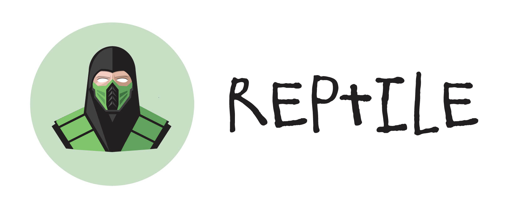
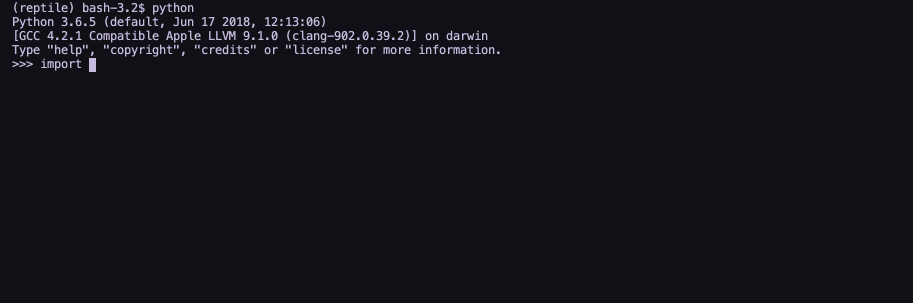
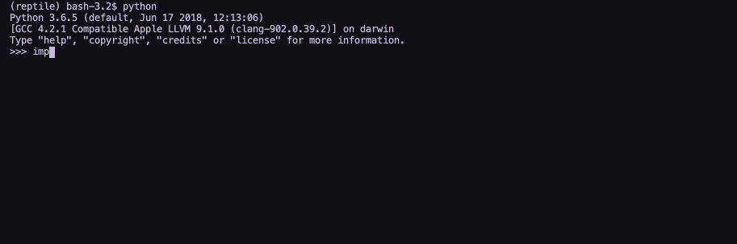

*The Reptile image is created by [Chill Desk](https://dribbble.com/shots/2274614-Mortal-Kombat-Reptile-Illustration).*

# Reptile

Reptile is a command-line interface for Python. Specifically, Reptile helps with producing interactive [REPL](https://en.wikipedia.org/wiki/Read%E2%80%93eval%E2%80%93print_loop)-like software. With Reptile, you can easily create different prompts depending on the specific type of question you want the user to respond to (input, list, checkbox, etc.).

The design of Reptile is heavily based on [PyInquirer](https://github.com/CITGuru/PyInquirer), which in turn is heavily based on [Inquirer.js](https://github.com/SBoudrias/Inquirer.js/). Compared to PyInquirer, Reptile features tow major improvements:

- It's based on the latest version of [prompt_toolkit](https://python-prompt-toolkit.readthedocs.io/en/master/) (3.0+), rather than 1.0.
- The code is well formatted, commented and documented.

To create prompts with Reptile is as simple as:

```python
import reptile

# Single-question prompt.
question = {
    "Type": "List",
    "Name": "Movie",
    "Message": "What's your favourite movie?",
    "Choices": ["Into the Wild", "Fight Club", "Casablanca"]
}
answers = reptile.prompt(question)

# {"Movie": "Casablanca"}
 ```

 ```python
import reptile

# Multiple-questions prompt.
questions = [
    {
        "Type": "Checkbox",
        "Name": "Books",
        "Message": "What books have you read?",
        "Choices": ["Infinite Jest", "The Little Prince", "The Hobbit"]
    },
    {
        "Type": "Confirm",
        "Name": "Confirmed",
        "Message": "Do you agree Parasite was a masterpiece?",
    },
    {
        "Type": "Input",
        "Name": "Name",
        "Message": "What's your name?",
    },
    {
        "Type": "List",
        "Name": "Movie",
        "Message": "What's your favourite movie?",
        "Choices": ["Into the Wild", "Fight Club", "Casablanca"]
    },
]
answers = reptile.prompt(question)

# {
#   "Checkbox": ["Infinite Jest", "The Little Prince", "The Hobbit"],
#   "Confirmed": False,
#   "Name": "Alessandro",
#   "Movie": "Casablanca",
# }
 ```

## The Prompts

### Checkbox



A **checkbox** is a prompt that allows the user to select zero, one or more options. It offers two shortcuts: \<a> to select all options and \<i> to invert the selections.

Options:
- Name: str → The name of the question. It's then used as key in the output dictionary (`answer = reptile.prompt(question)`).
- Message: str → The message to display to the user (the question itself).
- Choices: list → The options available to be selected.
- Values: list → A list of the same length of Choices. If available, the corresponded value(s) in Values is returned instead of the choice(s) selected by the user.
- Default: Any → The value to return if the output is empty.
- Validate: function → A function that takes the output of the prompt as input and returns either True (if validated) or a string (if not validated; the string is used as error message).
- Transform: function → A function that takes the output of the prompt and replaces it with something else.
- When: function → Used to create conditional flows of questions. It's a function that takes the whole answers dictionary and returns either True (if the question has to be asked) or False (if it's to be skiped).


### Confirm


**Confirm** is a prompt that allows the user to respond to a Yes or No question. It only accepts y/Y and n/N. The output value is True for Yes and False for No.

Options:
- Name: str → The name of the question. It's then used as key in the output dictionary (`answer = reptile.prompt(question)`).
- Message: str → The message to display to the user (the question itself).
- Transform: function → A function that takes the output of the prompt and replaces it with something else.
- When: function → Used to create conditional flows of questions. It's a function that takes the whole answers dictionary and returns either True (if the question has to be asked) or False (if it's to be skiped).

### Input



An **input** is a prompt that allows the user input its own value as text.

Options:
- Name: str → The name of the question. It's then used as key in the output dictionary (`answer = reptile.prompt(question)`).
- Message: str → The message to display to the user (the question itself).
- Default: Any → The value to return if the output is empty.
- Validate: function → A function that takes the output of the prompt as input and returns either True (if validated) or a string (if not validated; the string is used as error message).
- Transform: function → A function that takes the output of the prompt and replaces it with something else.
- When: function → Used to create conditional flows of questions. It's a function that takes the whole answers dictionary and returns either True (if the question has to be asked) or False (if it's to be skiped).

### List


A **list** is a prompt that allows the user to select one out of many options (but one and only one).

Options:
- Name: str → The name of the question. It's then used as key in the output dictionary (`answer = reptile.prompt(question)`).
- Message: str → The message to display to the user (the question itself).
- Choices: list → The options available to be selected.
- Values: list → A list of the same length of Choices. If available, the corresponded value(s) in Values is returned instead of the choice(s) selected by the user.
- Transform: function → A function that takes the output of the prompt and replaces it with something else.
- When: function → Used to create conditional flows of questions. It's a function that takes the whole answers dictionary and returns either True (if the question has to be asked) or False (if it's to be skiped).

## Development

### Tests 

You can run the unit tests via PyTest. After you've activated the virtual environment (`pipenv shell`), just execute:

```bash
python -m pytest
```

Reptile also comes with a handy manual test module, so that the interactions with the shell can be tested as well. To execute the module, activate the virtual environment and install Reptile from the local files themselves (rather than downloading the build from PyPI). An explanation of why this step is necessary can be found [here](https://stackoverflow.com/a/50194143/2154440). Once you've activated the virtual environment (again, `pipenv shell`), to install Reptile locally simply navigate to the folder containing the `setup.py` file and execute:

```bash
pipenv install -e .
```

The dot (`.`) means *here* and the `-e` flag signifies the package should be installed in *editable mode*, meaning all changes to the raw files will be reflected in the installed package live (this is only necessary if you inteded to make changes to Reptile).

Once Reptile has been installed locally, you can execute:

```bash
python tests/manual/manual.py
```

Just follow the instructions as they appear on-screen to complete the test.
